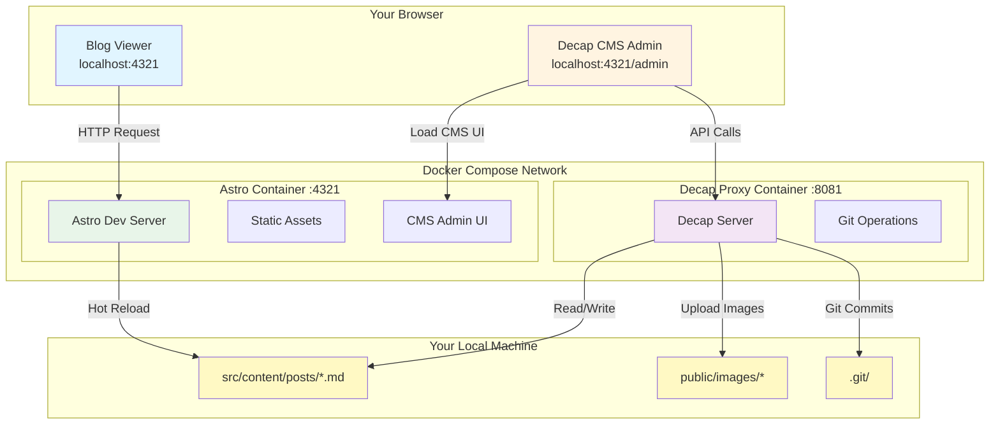

# Docker Setup for Twilight Blog

This document explains the Docker setup for running the Twilight blog with Decap CMS locally.

## Architecture Diagram



## Architecture Overview

The Docker Compose setup runs **two separate services**:

### 1. Astro Dev Server (`astro` service)
- **Port**: 4321
- **Purpose**: Serves your blog and the Decap CMS admin UI
- **Features**:
  - Hot-reload for instant updates
  - Serves static assets
  - Handles routing and page rendering

### 2. Decap CMS Proxy Server (`decap-proxy` service)
- **Port**: 8081
- **Purpose**: Provides Git-based API for Decap CMS
- **Features**:
  - Reads/writes markdown files in `src/content/posts`
  - Handles file uploads to `public/images`
  - Makes Git commits when you save changes
  - Acts as a bridge between browser and file system

## Why Two Separate Containers?

**Separation of Concerns**:
- **Astro** focuses on building and serving your site
- **Decap Proxy** focuses on content management and Git operations

**Security**:
- Browsers can't directly access the file system
- The proxy server provides a controlled API for file operations

**Modularity**:
- Each service can be scaled, updated, or replaced independently
- Decap CMS can work with any static site generator

**Production Similarity**:
- In production, you'd use GitHub/GitLab API instead of the proxy
- This setup mimics that architecture locally

## Quick Start

> **Important**: Make sure you have a `.env` file in your project root before running Docker. The containers need access to environment variables (like Umami config). If you don't have one, create an empty `.env` file or copy from `.env.example` if available.

### Option 1: Using Make (Recommended)

```bash
# Build and start both containers
make docker-dev

# View logs
make docker-logs

# Stop containers
make docker-down
```

### Option 2: Using Docker Compose Directly

```bash
# Build images
docker compose build

# Start containers in detached mode
docker compose up -d

# View logs
docker compose logs -f

# Stop containers
docker compose down
```

## Access Points

Once running, you can access:

- **Blog**: http://localhost:4321
- **Decap CMS Admin**: http://localhost:4321/admin
- **Decap Proxy API**: http://localhost:8081 (used internally by CMS)

## Volume Mounts

The setup uses volume mounts for **hot-reload** functionality:

### Astro Service Volumes
```yaml
- ./src:/app/src                    # Source code
- ./public:/app/public              # Static assets
- ./astro.config.mjs:/app/astro.config.mjs
- ./tsconfig.json:/app/tsconfig.json
- ./tailwind.config.cjs:/app/tailwind.config.cjs
```

### Decap Proxy Service Volumes
```yaml
- ./src/content:/app/src/content    # Blog posts
- ./public/images:/app/public/images # Media uploads
- ./public/admin:/app/public/admin   # CMS config
- ./.git:/app/.git                   # Git repository
```

### Shared Volume
```yaml
- node_modules:/app/node_modules    # Preserved in container
```

## How It Works

1. **You edit a post** in Decap CMS at `http://localhost:4321/admin`
2. **Decap CMS** sends API requests to the proxy server at `http://localhost:8081`
3. **Proxy server** writes the markdown file to `src/content/posts`
4. **Volume mount** syncs the file change to your local machine
5. **Astro dev server** detects the change and hot-reloads
6. **Browser** automatically refreshes with the new content

## Troubleshooting

### Missing .env file error
**Problem:** Astro crashes with "Cannot read properties of undefined" error in Docker

**Solution:**
```bash
# Create a .env file if you don't have one
touch .env

# Or copy from example if available
cp .env.example .env

# Then restart containers
make docker-down
make docker-up
```

The `.env` file is mounted into both containers and is required even if empty.

### Containers won't start
```bash
# Check if ports are already in use
lsof -i :4321
lsof -i :8081

# View detailed logs
docker compose logs
```

### Changes not reflecting
```bash
# Restart containers
make docker-down
make docker-up

# Or rebuild from scratch
docker compose down -v
make docker-dev
```

### Permission issues with Git
```bash
# The .git directory is mounted, ensure proper permissions
# On Linux, you may need to configure Git:
git config --global --add safe.directory /app
```

## Development Workflow

### Bare Metal (Traditional)
```bash
# Terminal 1
make dev

# Terminal 2
npx decap-server
```

### Docker (Containerized)
```bash
# Single command starts both services
make docker-dev

# View logs from both services
make docker-logs
```

## Production Deployment

For production, you would:

1. **Build the static site**:
   ```bash
   make build
   ```

2. **Deploy to hosting** (Vercel, Netlify, Cloudflare Pages, etc.)

3. **Configure Decap CMS** to use Git provider API:
   ```yaml
   # public/admin/config.yml
   backend:
     name: github  # or gitlab, bitbucket
     repo: username/repository
     branch: main
   ```

4. **No proxy server needed** - Decap CMS talks directly to GitHub/GitLab API

## Comparison: Bare Metal vs Docker

| Aspect | Bare Metal | Docker |
|--------|------------|--------|
| **Setup** | `pnpm install` | `make docker-dev` |
| **Processes** | 2 terminals | 1 command |
| **Dependencies** | Node.js, pnpm | Docker only |
| **Hot Reload** | ✅ Native | ✅ Via volumes |
| **Isolation** | ❌ Uses system Node | ✅ Containerized |
| **Portability** | ❌ Environment-dependent | ✅ Works anywhere |
| **Performance** | ⚡ Fastest | 🐢 Slight overhead |

## Advanced Configuration

### Custom Ports

Edit `docker-compose.yml`:
```yaml
ports:
  - "3000:4321"  # Map to different host port
```

### Production Build in Docker

Create `Dockerfile.prod`:
```dockerfile
FROM node:20-alpine AS builder
WORKDIR /app
COPY package.json pnpm-lock.yaml ./
RUN corepack enable && pnpm install --frozen-lockfile
COPY . .
RUN pnpm build

FROM nginx:alpine
COPY --from=builder /app/dist /usr/share/nginx/html
EXPOSE 80
CMD ["nginx", "-g", "daemon off;"]
```

## Resources

- [Docker Documentation](https://docs.docker.com/)
- [Docker Compose Documentation](https://docs.docker.com/compose/)
- [Decap CMS Documentation](https://decapcms.org/)
- [Astro Documentation](https://docs.astro.build/)
