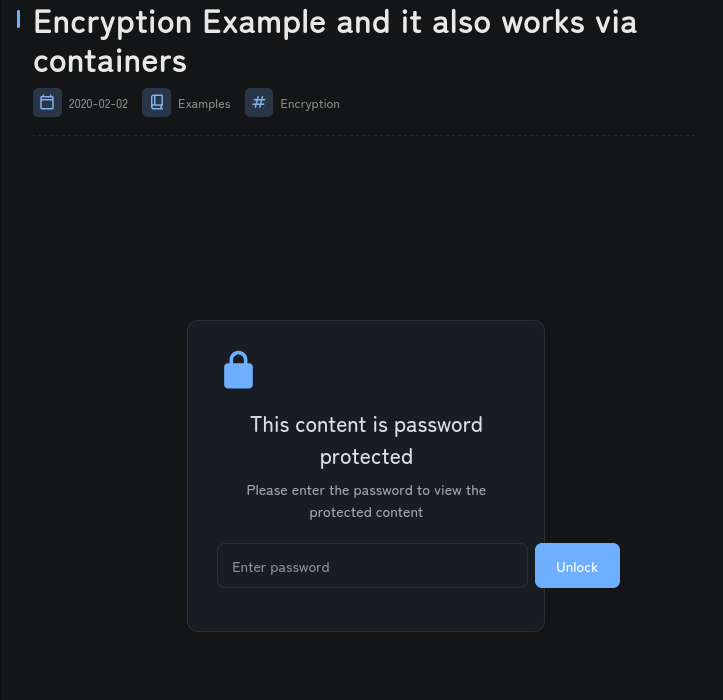
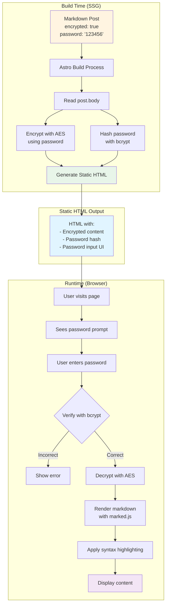

# Encrypted Posts in Astro SSG

This document explains how password-protected posts work in the Twilight blog theme, and how they function effectively even in Static Site Generation (SSG) mode.



## 🔐 How It Works

### The Technology Stack

The encrypted posts feature uses **client-side encryption** with the following technologies:

| **Technology** | Purpose | Where Used |
|------------|---------|------------|
| **CryptoJS (AES)** | Content encryption/decryption | Build time + Runtime |
| **bcrypt.js** | Password hashing & verification | Build time + Runtime |
| **marked.js** | Markdown rendering (client-side) | Runtime only |
| **highlight.js** | Syntax highlighting | Runtime only |

### The Process Flow



## 📝 How to Create an Encrypted Post

### Frontmatter Configuration

```yaml
---
title: My Secret Post
published: 2024-01-15
encrypted: true          # Enable encryption
password: "mysecretpass" # The password (will be hashed)
tags: [Private, Secure]
category: Personal
---

# This content will be encrypted

This entire markdown content will be encrypted at build time
and can only be decrypted by entering the correct password.
```

### Key Fields

- **`encrypted: true`** - Enables password protection
- **`password: "123456"`** - The password users must enter (stored in frontmatter during development, hashed at build time)

## 🔧 Technical Implementation

### Build-Time Encryption (SSG Phase)

Located in [`src/pages/posts/[...slug].astro`](file:///home/jalcocert/Desktop/Twilight/src/pages/posts/[...slug].astro#L66-L85):

```typescript
// Check if post is encrypted
let isEncrypted = entry.data.encrypted && entry.data.password;

if (isEncrypted) {
    // Get the raw markdown content
    const contentToEncrypt = entry.body;
    
    // Encrypt with AES using the password
    encryptedContent = CryptoJS.AES.encrypt(
        contentToEncrypt,
        entry.data.password,
    ).toString();
    
    // Hash the password with bcrypt
    const saltRounds = 10;
    passwordHash = bcryptjs.hashSync(entry.data.password, saltRounds);
}
```

**What happens:**

1. ✅ Raw markdown content is encrypted with **AES-256**
2. ✅ Password is hashed with **bcrypt** (10 salt rounds)
3. ✅ Encrypted content + password hash are embedded in static HTML
4. ❌ Original password is **never** stored in the output
5. ❌ Original content is **never** visible in HTML source

### Runtime Decryption (Browser)

Located in [`src/components/PasswordProtection.astro`](file:///home/jalcocert/Desktop/Twilight/src/components/PasswordProtection.astro):

```javascript
async function attemptUnlock() {
    const inputPassword = passwordInput.value.trim();
    
    // 1. Verify password with bcrypt
    const isPasswordCorrect = bcrypt.compareSync(inputPassword, passwordHash);
    
    if (!isPasswordCorrect) {
        showError("Incorrect password");
        return;
    }
    
    // 2. Decrypt content with AES
    const decryptedBytes = CryptoJS.AES.decrypt(encryptedContent, inputPassword);
    const decryptedContent = decryptedBytes.toString(CryptoJS.enc.Utf8);
    
    // 3. Render markdown in browser
    await renderMarkdownContent(decryptedContent);
    
    // 4. Display decrypted content
    protectionDiv.style.display = 'none';
    contentDiv.style.display = 'block';
}
```

**What happens:**
1. ✅ User enters password
2. ✅ Password is verified against bcrypt hash (client-side)
3. ✅ If correct, AES decrypts the content
4. ✅ Markdown is rendered using `marked.js`
5. ✅ Syntax highlighting applied with `highlight.js`
6. ✅ Content displayed with full formatting

## 🚀 Does This Work with SSG?

### ✅ YES! Here's Why:

**Static Site Generation (SSG)** means all HTML is pre-rendered at build time. Encrypted posts work perfectly because:

1. **Build Time**:
   - Content is encrypted and embedded in static HTML
   - No server needed to serve the page
   - Password hash is included in the HTML

2. **Runtime**:
   - All decryption happens **client-side** in the browser
   - JavaScript libraries (CryptoJS, bcrypt.js) are loaded from static files
   - No backend API calls required

3. **Deployment**:
   - Works on **any static hosting** (Cloudflare Pages, Netlify, Vercel, GitHub Pages)
   - No server-side processing needed
   - No database required

### The Static Files

```
dist/
├── posts/
│   └── encryption/
│       └── index.html          # Contains encrypted content
├── assets/
│   └── js/
│       ├── crypto-js.min.js    # AES encryption library
│       ├── bcrypt.min.js       # Password hashing library
│       ├── marked.min.js       # Markdown parser
│       └── highlight.min.js    # Syntax highlighter
```

All files are **static** and can be served from a CDN!

## 🔒 Security Analysis

### What's Secure ✅

1. **Content Encryption**: AES-256 is military-grade encryption
2. **Password Hashing**: bcrypt with salt rounds prevents rainbow table attacks
3. **No Plaintext**: Original content never appears in HTML source
4. **No Server Needed**: No backend to hack or compromise

### What's NOT Secure ❌

1. **Client-Side Decryption**: Anyone with the password can decrypt
2. **No Rate Limiting**: Brute force attempts are possible (though bcrypt makes it slow)
3. **Password in Frontmatter**: During development, password is in plaintext in `.md` file
4. **Session Storage**: Unlocked state is saved in browser (optional feature)
5. **No Perfect Forward Secrecy**: If password is compromised, all historical content is readable

### Security Level

This is **NOT** suitable for:
- ❌ Highly sensitive data (medical records, financial info)
- ❌ Compliance requirements (HIPAA, GDPR encrypted data)
- ❌ Multi-user access control
- ❌ Audit logging requirements

This **IS** suitable for:
- ✅ Personal blog posts you want to keep semi-private
- ✅ Draft content shared with specific people
- ✅ Paywalled content (with simple password sharing)
- ✅ "Members only" sections with shared password

## 🎨 User Experience

### Before Unlock

```
┌─────────────────────────────────┐
│          🔒                      │
│   Password Protected Content    │
│                                  │
│   This content is encrypted     │
│                                  │
│   ┌─────────────────┐  [Unlock] │
│   │ Enter password  │           │
│   └─────────────────┘           │
└─────────────────────────────────┘
```

### After Unlock

```
┌─────────────────────────────────┐
│   # My Secret Post              │
│                                  │
│   This content was encrypted... │
│                                  │
│   ```javascript                 │
│   const secret = "revealed";    │
│   ```                            │
│                                  │
│   Full markdown rendering with: │
│   - Syntax highlighting ✅      │
│   - Code copy buttons ✅        │
│   - Heading anchors ✅          │
│   - Table of contents ✅        │
└─────────────────────────────────┘
```

## 🔄 Comparison: SSG vs SSR

| Feature | SSG (Current) | SSR (Server-Side) |
|---------|---------------|-------------------|
| **Hosting** | Static (CDN) | Requires server |
| **Performance** | ⚡ Instant load | 🐢 Server processing |
| **Cost** | 💰 Free/cheap | 💰💰 Server costs |
| **Security** | Client-side | Server-side |
| **Rate Limiting** | ❌ Not possible | ✅ Easy to implement |
| **Audit Logs** | ❌ No logging | ✅ Full logging |
| **Scalability** | ✅ Infinite (CDN) | 🔄 Depends on server |
| **Password Changes** | ❌ Requires rebuild | ✅ Dynamic |

## 🛠️ Advanced Customization

### Change Encryption Algorithm

Edit [`src/pages/posts/[...slug].astro`](file:///home/jalcocert/Desktop/Twilight/src/pages/posts/[...slug].astro#L77):

```typescript
// Current: AES
encryptedContent = CryptoJS.AES.encrypt(contentToEncrypt, password).toString();

// Alternative: Triple DES
encryptedContent = CryptoJS.TripleDES.encrypt(contentToEncrypt, password).toString();

// Alternative: Rabbit
encryptedContent = CryptoJS.Rabbit.encrypt(contentToEncrypt, password).toString();
```

### Increase bcrypt Rounds

Edit [`src/pages/posts/[...slug].astro`](file:///home/jalcocert/Desktop/Twilight/src/pages/posts/[...slug].astro#L83):

```typescript
// Current: 10 rounds (fast, less secure)
const saltRounds = 10;

// More secure: 12 rounds (slower, more secure)
const saltRounds = 12;

// Maximum security: 15 rounds (very slow, very secure)
const saltRounds = 15;
```

**Note**: Higher rounds = slower password verification = better brute-force protection

### Session Persistence

The unlocked state is saved in `sessionStorage`:

```javascript
// Save unlock state
sessionStorage.setItem('page-unlocked-' + window.location.pathname, 'true');

// Check if already unlocked
if (sessionStorage.getItem('page-unlocked-' + window.location.pathname) === 'true') {
    // Auto-unlock (requires storing password - not recommended)
}
```

**Security Note**: This is **not secure** if you store the password. It's only for UX convenience.

## 📊 Performance Impact

### Build Time

- **Encryption**: ~1-5ms per post (negligible)
- **Hashing**: ~50-100ms per post (bcrypt is intentionally slow)
- **Total**: Minimal impact on build time

### Runtime (Browser)

- **Library Loading**: ~100-200KB total (CryptoJS + bcrypt + marked + highlight)
- **Decryption**: ~10-50ms (depends on content size)
- **Rendering**: ~50-200ms (depends on markdown complexity)
- **Total**: ~200-500ms from password entry to content display

### Network Impact

```
Normal Post:     index.html (50KB)
Encrypted Post:  index.html (50KB) + libraries (200KB) = 250KB total
```

Libraries are **cached** after first load, so subsequent encrypted posts load faster.

## 🌐 Production Deployment

### Cloudflare Pages

```bash
# Build command
pnpm build

# Output directory
dist

# Environment variables (none needed for encrypted posts)
```

**Works perfectly!** All encryption/decryption is client-side.

### Netlify

```toml
# netlify.toml
[build]
  command = "pnpm build"
  publish = "dist"
```

**Works perfectly!** No server-side processing required.

### Vercel

```json
{
  "buildCommand": "pnpm build",
  "outputDirectory": "dist"
}
```

**Works perfectly!** Static export works with encrypted posts.

## 🔍 Debugging Encrypted Posts

### Check if Encryption is Working

1. **View page source** - Content should be encrypted gibberish:
   ```html
   <script>
     const encryptedContent = "U2FsdGVkX1+vupppZksvRf5pq5g5XjFRIipRkwB0K1Y=";
   </script>
   ```

2. **Check password hash** - Should be bcrypt format:
   ```html
   <script>
     const passwordHash = "$2a$10$N9qo8uLOickgx2ZMRZoMyeIjZAgcfl7p92ldGxad68LJZdL17lhWy";
   </script>
   ```

3. **Test decryption** - Enter wrong password, should show error

### Common Issues

**Issue**: "Cannot read properties of undefined"
- **Cause**: CryptoJS or bcrypt library not loaded
- **Fix**: Check `/assets/js/` files exist in `dist/`

**Issue**: Content doesn't decrypt
- **Cause**: Wrong password or encryption mismatch
- **Fix**: Verify password in frontmatter matches

**Issue**: Styling broken after decrypt
- **Cause**: Markdown rendering missing CSS
- **Fix**: Check highlight.js CSS is loaded

## 🎯 Use Cases

### 1. **Paywalled Content**
```yaml
---
encrypted: true
password: "premium2024"  # Share with paying members
---
```

### 2. **Draft Sharing**
```yaml
---
encrypted: true
password: "review-draft-123"  # Share with reviewers
---
```

### 3. **Personal Notes**
```yaml
---
encrypted: true
password: "my-secret-diary"  # Keep private
---
```

### 4. **Time-Limited Access**
```yaml
---
encrypted: true
password: "event-2024-01-15"  # Change password after event
---
```

## 🚦 Best Practices

### ✅ DO

1. **Use strong passwords** - At least 12 characters, mixed case, numbers, symbols
2. **Change passwords periodically** - Rebuild site with new password
3. **Use different passwords** - Don't reuse across posts
4. **Document password sharing** - Keep track of who has access
5. **Test before deploying** - Verify encryption works

### ❌ DON'T

1. **Store sensitive data** - This is NOT enterprise-grade security
2. **Commit passwords to Git** - Use environment variables for production
3. **Share passwords publicly** - Defeats the purpose
4. **Rely on this for compliance** - Not suitable for regulated data
5. **Forget to rebuild** - Password changes require rebuild

## 🔮 Future Enhancements

Possible improvements (not currently implemented):

1. **Server-Side Verification**: Add API endpoint for password verification
2. **Rate Limiting**: Prevent brute force attacks
3. **Multiple Passwords**: Different access levels per post
4. **Expiring Passwords**: Time-based access control
5. **Audit Logging**: Track who accessed what and when
6. **2FA Support**: Two-factor authentication for extra security

## 📚 Related Files

- [`src/pages/posts/[...slug].astro`](file:///home/jalcocert/Desktop/Twilight/src/pages/posts/[...slug].astro) - Build-time encryption
- [`src/components/PasswordProtection.astro`](file:///home/jalcocert/Desktop/Twilight/src/components/PasswordProtection.astro) - Runtime decryption UI
- [`src/content.config.ts`](file:///home/jalcocert/Desktop/Twilight/src/content.config.ts#L24) - Schema definition
- [`src/content/posts/encryption.md`](file:///home/jalcocert/Desktop/Twilight/src/content/posts/encryption.md) - Example encrypted post

## 🎓 Summary

**Encrypted posts in Astro SSG work by:**

1. ✅ Encrypting content at **build time** with AES
2. ✅ Hashing passwords with **bcrypt**
3. ✅ Embedding encrypted data in **static HTML**
4. ✅ Decrypting **client-side** in the browser
5. ✅ Rendering markdown with **JavaScript libraries**

**This approach:**
- ✅ Works perfectly with SSG
- ✅ Requires no backend server
- ✅ Can be deployed to any static host
- ✅ Provides reasonable security for non-sensitive content
- ❌ Is NOT suitable for highly sensitive data
- ❌ Cannot prevent determined attackers with the password

**Perfect for:** Personal blogs, draft sharing, simple paywalls, member-only content

**Not suitable for:** Medical records, financial data, compliance requirements, enterprise security
