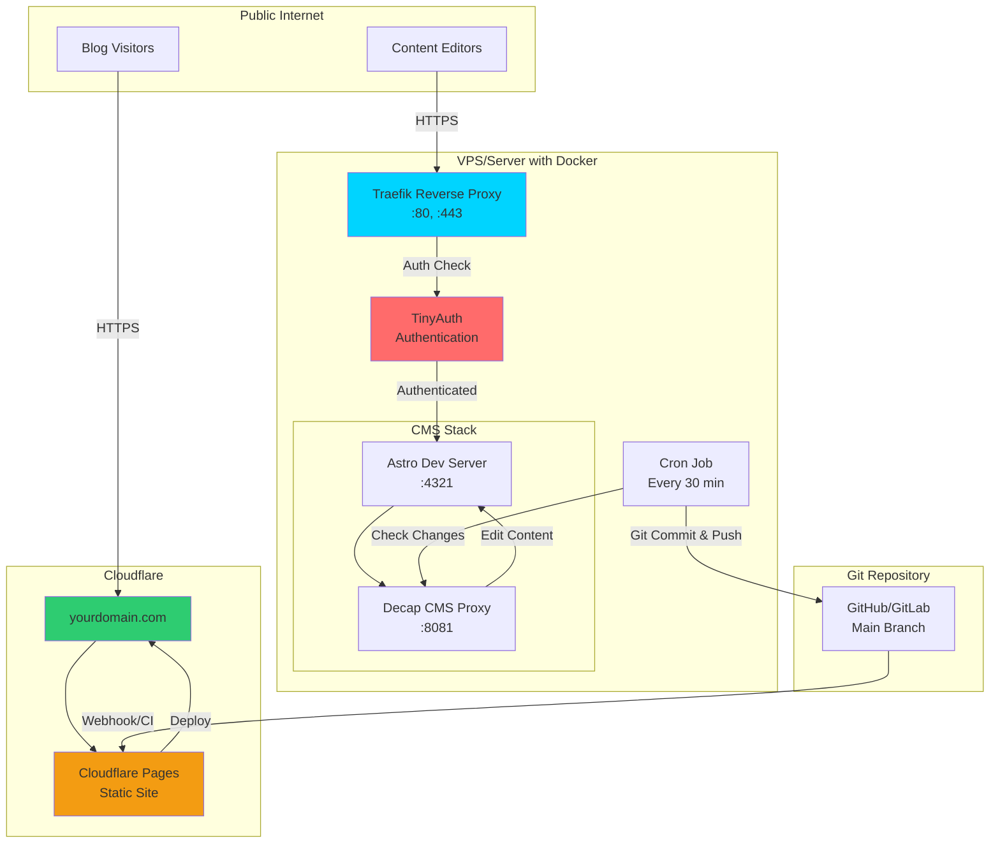

# Next Steps: Production-Ready CMS with Authentication & CI/CD

This document outlines a production-ready architecture for the Twilight blog with authenticated CMS access, automatic deployments, and enterprise-grade security.

## 🎯 Proposed Architecture



## 📋 Implementation Plan

### Phase 1: Add Traefik Reverse Proxy

**Purpose**: SSL termination, routing, and automatic HTTPS certificates

**Implementation**:

1. **Add Traefik to `docker-compose.yml`**:
   ```yaml
   services:
     traefik:
       image: traefik:v2.10
       container_name: twilight-traefik
       command:
         - "--api.dashboard=true"
         - "--providers.docker=true"
         - "--entrypoints.web.address=:80"
         - "--entrypoints.websecure.address=:443"
         - "--certificatesresolvers.letsencrypt.acme.email=your@email.com"
         - "--certificatesresolvers.letsencrypt.acme.storage=/letsencrypt/acme.json"
         - "--certificatesresolvers.letsencrypt.acme.httpchallenge.entrypoint=web"
       ports:
         - "80:80"
         - "443:443"
       volumes:
         - /var/run/docker.sock:/var/run/docker.sock:ro
         - ./letsencrypt:/letsencrypt
       networks:
         - twilight-network
   ```

2. **Add Traefik labels to Astro service**:
   ```yaml
   astro:
     labels:
       - "traefik.enable=true"
       - "traefik.http.routers.cms.rule=Host(`cms.yourdomain.com`)"
       - "traefik.http.routers.cms.entrypoints=websecure"
       - "traefik.http.routers.cms.tls.certresolver=letsencrypt"
       - "traefik.http.services.cms.loadbalancer.server.port=4321"
   ```

**Benefits**:
- ✅ Automatic HTTPS with Let's Encrypt
- ✅ Easy subdomain routing
- ✅ Load balancing capabilities
- ✅ Dashboard for monitoring

---

### Phase 2: Add TinyAuth Authentication

**Purpose**: Protect the CMS admin interface with username/password authentication

**Implementation**:

1. **Add TinyAuth service**:
   ```yaml
   tinyauth:
     image: ghcr.io/fossfrog/tinyauth:latest
     container_name: twilight-tinyauth
     environment:
       - TINYAUTH_USERS=editor:${EDITOR_PASSWORD_HASH}
       - TINYAUTH_COOKIE_SECRET=${COOKIE_SECRET}
       - TINYAUTH_FORWARD_URL=http://astro:4321
     labels:
       - "traefik.enable=true"
       - "traefik.http.routers.auth.rule=Host(`cms.yourdomain.com`)"
       - "traefik.http.routers.auth.entrypoints=websecure"
       - "traefik.http.routers.auth.tls.certresolver=letsencrypt"
       - "traefik.http.routers.auth.middlewares=tinyauth"
       - "traefik.http.middlewares.tinyauth.forwardauth.address=http://tinyauth:8080/auth"
     networks:
       - twilight-network
   ```

2. **Generate password hash**:
   ```bash
   # Install htpasswd
   sudo apt install apache2-utils
   
   # Generate password hash
   htpasswd -nbB editor your_password
   
   # Add to .env
   EDITOR_PASSWORD_HASH='editor:$2y$05$...'
   COOKIE_SECRET='generate_random_32_char_string'
   ```

**Benefits**:
- ✅ Lightweight authentication (no database needed)
- ✅ Protects CMS admin interface
- ✅ Easy user management
- ✅ Session-based authentication

**Alternative**: You could also use:
- **Authelia** - More features, LDAP/OIDC support
- **OAuth2 Proxy** - GitHub/Google OAuth
- **Basic Auth** - Traefik's built-in basic auth

---

### Phase 3: Automated Git Commits

**Purpose**: Automatically commit and push changes made through the CMS

**Implementation**:

1. **Create commit script** (`scripts/auto-commit.sh`):
   ```bash
   #!/bin/bash
   
   # Navigate to repo
   cd /app
   
   # Configure git
   git config user.name "CMS Auto-Commit"
   git config user.email "cms@yourdomain.com"
   
   # Check for changes
   if [[ -n $(git status --porcelain) ]]; then
       echo "Changes detected, committing..."
       
       # Add all changes
       git add src/content/posts/* public/images/*
       
       # Commit with timestamp
       git commit -m "CMS Update: $(date '+%Y-%m-%d %H:%M:%S')"
       
       # Push to remote
       git push origin main
       
       echo "Changes committed and pushed successfully"
   else
       echo "No changes detected"
   fi
   ```

2. **Add cron service to `docker-compose.yml`**:
   ```yaml
   cron:
     build:
       context: .
       dockerfile: Dockerfile.cron
     container_name: twilight-cron
     volumes:
       - ./src/content:/app/src/content
       - ./public/images:/app/public/images
       - ./.git:/app/.git
       - ./scripts:/app/scripts
     environment:
       - GIT_SSH_COMMAND=ssh -i /app/.ssh/id_rsa -o StrictHostKeyChecking=no
     networks:
       - twilight-network
   ```

3. **Create `Dockerfile.cron`**:
   ```dockerfile
   FROM alpine:latest
   
   RUN apk add --no-cache git bash dcron
   
   WORKDIR /app
   
   # Add cron job (every 30 minutes)
   RUN echo "*/30 * * * * /app/scripts/auto-commit.sh >> /var/log/cron.log 2>&1" > /etc/crontabs/root
   
   CMD ["crond", "-f", "-l", "2"]
   ```

4. **Setup SSH key for Git push**:
   ```bash
   # Generate SSH key
   ssh-keygen -t ed25519 -C "cms@yourdomain.com" -f .ssh/id_rsa
   
   # Add public key to GitHub/GitLab as deploy key with write access
   cat .ssh/id_rsa.pub
   ```

**Benefits**:
- ✅ Automatic commits every 30 minutes
- ✅ No manual Git operations needed
- ✅ Preserves Git history
- ✅ Triggers CI/CD automatically

**Alternative Approaches**:
- **Webhook-based**: Trigger commit on CMS save event
- **Real-time**: Use file watchers (inotify) for instant commits
- **Manual**: Keep a "Publish" button in the CMS

---

### Phase 4: Cloudflare Pages CI/CD

**Purpose**: Automatically build and deploy static site to Cloudflare Pages

**Implementation**:

1. **Connect GitHub to Cloudflare Pages**:
   - Go to Cloudflare Dashboard → Pages
   - Click "Create a project"
   - Connect your GitHub repository
   - Configure build settings:
     ```
     Build command: pnpm build
     Build output directory: dist
     Root directory: /
     ```

2. **Set environment variables in Cloudflare**:
   ```
   NODE_VERSION=20
   PNPM_VERSION=9.14.4
   ```

3. **Configure custom domain**:
   - In Cloudflare Pages → Custom domains
   - Add your domain: `yourdomain.com`
   - Cloudflare automatically handles DNS and SSL

4. **Optional: Add build hook for manual triggers**:
   ```bash
   # Trigger build manually
   curl -X POST https://api.cloudflare.com/client/v4/pages/webhooks/deploy/YOUR_HOOK_ID
   ```

**Benefits**:
- ✅ Automatic builds on every push
- ✅ Global CDN distribution
- ✅ Free SSL certificates
- ✅ Unlimited bandwidth (on Free plan)
- ✅ Preview deployments for branches
- ✅ Rollback capabilities

**Build Process**:
```
Git Push → GitHub → Cloudflare Pages → Build (pnpm build) → Deploy → CDN
```

---

## 🔐 Security Considerations

### 1. **Separate CMS and Public Site**
- **CMS**: `cms.yourdomain.com` (authenticated, private)
- **Public Site**: `yourdomain.com` (static, on Cloudflare Pages)

### 2. **Network Isolation**
```yaml
networks:
  twilight-network:
    driver: bridge
    internal: false  # Allow external access only through Traefik
```

### 3. **Environment Variables**
```bash
# .env (never commit this!)
EDITOR_PASSWORD_HASH='bcrypt_hash_here'
COOKIE_SECRET='random_32_char_string'
GITHUB_TOKEN='ghp_xxx'  # For private repos
CLOUDFLARE_API_TOKEN='xxx'  # For API access
```

### 4. **Firewall Rules**
```bash
# Only allow ports 80 and 443
ufw allow 80/tcp
ufw allow 443/tcp
ufw enable
```

### 5. **Rate Limiting**
Add to Traefik:
```yaml
- "traefik.http.middlewares.ratelimit.ratelimit.average=10"
- "traefik.http.middlewares.ratelimit.ratelimit.burst=20"
```

---

## 📊 Complete Architecture Flow

### Content Creation Flow
```
1. Editor logs in → cms.yourdomain.com
2. TinyAuth validates credentials
3. Traefik forwards to Astro CMS
4. Editor creates/edits post via Decap CMS
5. Decap Proxy saves to src/content/posts/
6. Cron job (every 30 min) detects changes
7. Auto-commit script commits & pushes to GitHub
8. GitHub webhook triggers Cloudflare Pages build
9. Cloudflare builds static site (pnpm build)
10. Cloudflare deploys to global CDN
11. Public accesses yourdomain.com
```

### Technology Stack

| Layer | Technology | Purpose |
|-------|-----------|---------|
| **Reverse Proxy** | Traefik | SSL, routing, load balancing |
| **Authentication** | TinyAuth | Protect CMS access |
| **CMS** | Decap CMS | Content management UI |
| **Framework** | Astro | Static site generation |
| **Automation** | Cron + Git | Auto-commit changes |
| **CI/CD** | Cloudflare Pages | Build & deploy |
| **Hosting** | Cloudflare CDN | Global content delivery |
| **DNS** | Cloudflare | Domain management |

---

## 💰 Cost Analysis

| Service | Cost | Notes |
|---------|------|-------|
| **VPS** (for CMS) | $5-10/month | DigitalOcean, Linode, Hetzner |
| **Cloudflare Pages** | Free | Unlimited bandwidth |
| **Domain** | $10-15/year | .com domain |
| **SSL Certificates** | Free | Let's Encrypt via Traefik |
| **Total** | **~$6-11/month** | Very cost-effective! |

**Alternatives**:
- **Netlify CMS + Netlify**: $0 (free tier), but vendor lock-in
- **Vercel**: $0 (free tier), similar to Cloudflare
- **GitHub Pages**: $0, but limited features

---

## 🚀 Deployment Steps

### Step 1: Prepare VPS

```bash
# Install Docker
curl -fsSL https://get.docker.com | sh

# Clone repository
git clone https://github.com/yourusername/twilight.git
cd twilight

# Create .env file
cp .env.example .env
# Edit .env with your credentials
```

### Step 2: Configure DNS

```
# Add DNS records in Cloudflare
A    cms.yourdomain.com    → VPS_IP_ADDRESS
CNAME yourdomain.com       → twilight.pages.dev
```

### Step 3: Deploy Stack

```bash
# Start all services
make docker-dev

# Check logs
make docker-logs

# Verify Traefik dashboard
https://cms.yourdomain.com:8080
```

### Step 4: Setup Cloudflare Pages

1. Connect GitHub repository
2. Configure build settings
3. Add custom domain
4. Wait for first deployment

### Step 5: Test Workflow

1. Login to `cms.yourdomain.com`
2. Create a test post
3. Wait 30 minutes (or trigger cron manually)
4. Verify commit in GitHub
5. Check Cloudflare Pages build
6. Visit `yourdomain.com` to see changes

---

## 🔧 Maintenance & Monitoring

### Monitoring

- **Traefik Dashboard**: Monitor traffic and routes
- **Cloudflare Analytics**: Page views, bandwidth
- **GitHub Actions**: Build status
- **Docker logs**: `docker compose logs -f`

### Backups

```bash
# Backup content
tar -czf backup-$(date +%Y%m%d).tar.gz src/content public/images

# Backup to S3/B2
rclone copy backup-*.tar.gz remote:backups/
```

### Updates

```bash
# Update Docker images
docker compose pull
docker compose up -d

# Update dependencies
pnpm update
```

---

## 🎓 Learning Resources

- [Traefik Documentation](https://doc.traefik.io/traefik/)
- [TinyAuth GitHub](https://github.com/fossfrog/tinyauth)
- [Cloudflare Pages Docs](https://developers.cloudflare.com/pages/)
- [Decap CMS Docs](https://decapcms.org/docs/)
- [Docker Compose Docs](https://docs.docker.com/compose/)

---

## 🤔 Alternative Architectures

### Option A: Serverless CMS

- Use Cloudflare Workers for authentication
- Decap CMS with GitHub backend (OAuth)
- No VPS needed, fully serverless
- **Pros**: No server maintenance, auto-scaling
- **Cons**: More complex setup, vendor lock-in

### Option B: Headless CMS

- Use Strapi/Directus/Payload CMS
- API-driven content management
- More features (media library, roles, etc.)
- **Pros**: Rich features, multi-user support
- **Cons**: More resource-intensive, complex

### Option C: Git-based Workflow

- No CMS, direct Git commits
- Use VS Code + Git for editing
- Cloudflare Pages for deployment
- **Pros**: Simple, no authentication needed
- **Cons**: Requires technical knowledge

---

## ✅ Recommended Next Steps

1. **Start with Traefik** - Get SSL and routing working
2. **Add TinyAuth** - Secure the CMS interface
3. **Test manually** - Verify authentication and CMS work
4. **Add auto-commit** - Automate Git operations
5. **Setup Cloudflare Pages** - Connect CI/CD pipeline
6. **Monitor & optimize** - Fine-tune performance

This architecture provides a **production-ready, secure, and automated** blogging platform that **separates content management from content delivery**, ensuring both security and performance! 🚀